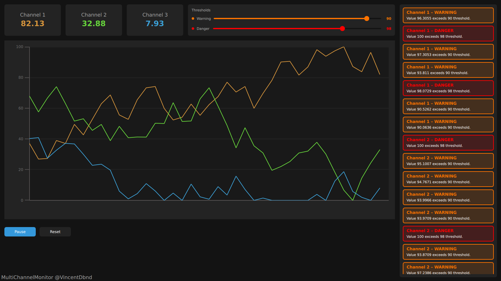

# MultiChannelMonitor

A small Qt6 / QML **training project**, built to learn and experiment with the Qt/QML stack: C++/QML interoperability, multithreading, reactive UI bindings, custom models, and live data visualization.

This is not a production application — it's a sandbox used to get hands-on with Qt concepts before applying them on real projects.

Development was assisted by [Claude Sonnet](https://www.anthropic.com/claude) (Anthropic), used as a learning aid to explore Qt/QML patterns, review the C++ code, write the unit test suite, and iterate on the design — all changes were reviewed and understood before being kept.

## Screenshot



## What it demonstrates

- **C++ / QML integration** — C++ types (`AcquisitionEngine`, `MeasurementChannel`, `NotificationsModel`) exposed to QML via `QML_ELEMENT`, `Q_PROPERTY`, and `Q_INVOKABLE`.
- **Multithreading** — a background `AcquisitionWorker` runs on its own `QThread` (via `moveToThread`) and communicates with the GUI thread exclusively through queued signal/slot connections, keeping simulated data acquisition off the UI thread.
- **Custom Qt models** — `NotificationsModel` implements `QAbstractListModel` to feed a QML `ListView` of threshold-breach alerts.
- **QQmlListProperty** — exposing a `QList<MeasurementChannel*>` to QML as an iterable list property, consumed via `Repeater` and `Instantiator`.
- **Live charting** — a scrolling multi-series line chart built with `QtGraphs`, updated in real time as new samples arrive.
- **Reactive QML UI** — property bindings, a shared style singleton (`GlobalStyle`), and a configurable threshold editor driving warning/danger notifications.

## Architecture overview

```
AcquisitionEngine (GUI thread)
  ├─ owns MeasurementChannel* (GUI thread) and NotificationsModel
  ├─ owns AcquisitionWorker, moved to a dedicated QThread
  └─ start()/pause()/reset() <--queued signals--> AcquisitionWorker
                                                      │
                                            generates simulated samples
                                            emits sampleReady(channel, value)
                                                      │
AcquisitionEngine::onSampleReady() <---queued signal---
  ├─ updates the corresponding MeasurementChannel (GUI thread only)
  └─ checks warning/danger thresholds, pushes NotificationsModel entries
```

QML binds directly to `MeasurementChannel::currentValue` and `NotificationsModel`, so the UI updates automatically whenever new samples arrive on the worker thread.

## Requirements

- Qt 6 (Core, Gui, Qml, Quick, QuickControls2, Graphs)
- CMake >= 3.16
- A C++17 compiler

## Build & run

```bash
cmake -B cmake-build-debug -S .
cmake --build cmake-build-debug
./cmake-build-debug/bin/MultiChannelMonitor
```

## Tests

Unit tests use `Qt Test` and cover the C++ core (`MeasurementChannel`, `NotificationsModel`, `AcquisitionWorker`), independently of the QML layer.

```bash
cmake -B cmake-build-debug -S .
cmake --build cmake-build-debug
cd cmake-build-debug && ctest --output-on-failure
```

## Tech stack

Qt 6, QML, QtGraphs, CMake, C++17.
